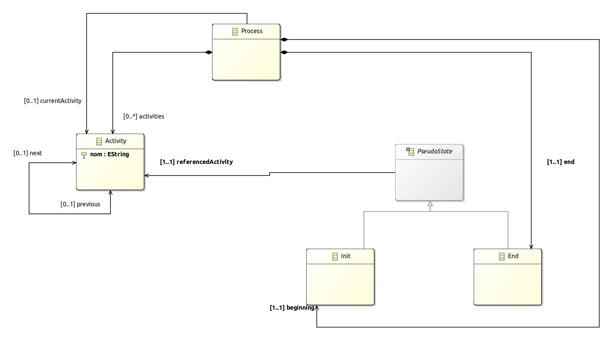
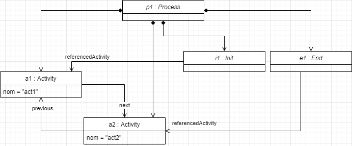
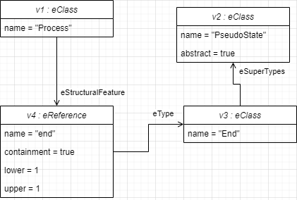

# M2 - HMIN301 - 22 septembre 2020

On s'intéresse à un méta-modèle de processus simpliste. Il vous est donné [ci-après](./CC1.jpg).

Un processus (méta-classe **Process**) est formé d'une séquence ordonnée d'activités (méta-classe **Activity**),
avec un début (référence **beginning**) et une fin (référence **end**). **Init** et **End** sont des pseudo-états (méta-classe
**Pseudo-State**, qui est abstraite), chaque pseudo-état référence une activité (soit l'activité de début, soit la
dernière du processus). Une activité, à l'exception de la dernière du processus, possède une activité suivante
(référence **next**), ce qui permet de définir la séquence d'activités du processus. De même, une activité, sauf la
première, possède une activité précédente (référence **previous**). Si l'on est en train d'exécuter ce processus,
**activiteCourante** référence, parmi les activités du processus, l'activité en cours du processus, sinon, elle n'est
pas positionnée.

##	Questions

###	Les relations de composition vous paraissent-elles correctement positionnées ? Justifiez.

Les relations de composition ne me paraissent pas bien positionnées, puisqu'il manque une composition avec la classe abstraite **PseudoState**. Cette composition pourrait être intitulé *états*, d'une cardinalité de \[2..2\].

Cette composition est nécéssaire, si et seulement si il est nécéssaire de posseder une classe racine, comme vu en cours pour manipuler le métamodèle plus tard avec ECore.

###	Donnez en syntaxe abstraite (sous forme d'instance du métamodèle) un processus composé de deux activités nommées act1 et act2. Le processus commence par act1, se poursuite par act2 puis se termine.

###	Donnez en syntaxe abstraite (sous forme d'instance d'ECore) l'extrait du métamodèle limité aux métaclasses Process, PseudoState et End, ainsi qu'à la composition entre Process et End.

